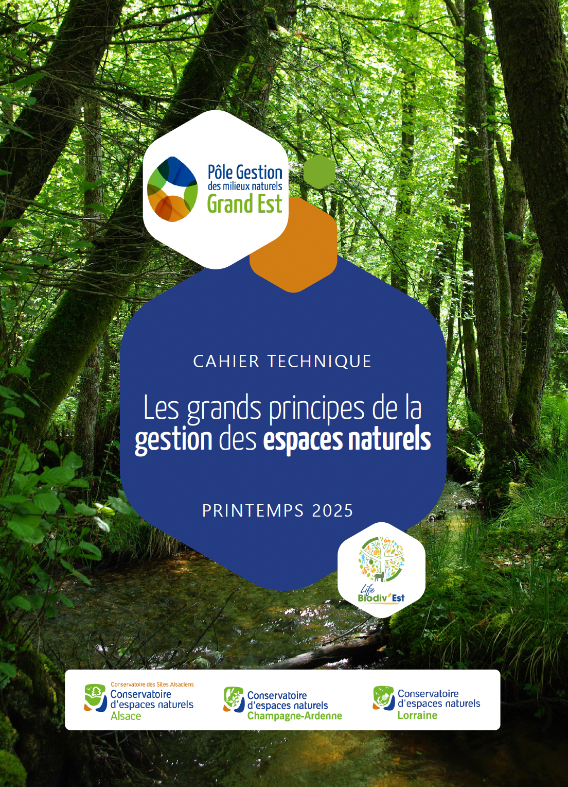

<style>
  .col2 {
    columns: 2 200px;         /* number of columns and width in pixels*/
    -webkit-columns: 2 200px; /* chrome, safari */
    -moz-columns: 2 200px;    /* firefox */
  }
  .col3 {
    columns: 3 100px;
    -webkit-columns: 3 100px;
    -moz-columns: 3 100px;
  }
slides > slide {
  overflow-x: auto !important;
  overflow-y: auto !important;
}
</style>

# Objectifs du cours

- Qu'est-ce qu'un plan de gestion ?
- Pourquoi faire un plan de gestion ?
- Comment faire un plan de gestion ?

# Introduction

Un plan de gestion est un document cadre qui fixe les enjeux et les objectifs de la gestion des espaces naturels.

Méthodolgie commune : CT88


# Quels espaces sont concernés ?

- CEN

- RNR, RNN

- RBD, RBI

- APPB

#

# Quelques références

## Pour aller plus loin
[https://ct88.espaces-naturels.fr/guide-delaboration-des-plans-de-gestion](https://ct88.espaces-naturels.fr/guide-delaboration-des-plans-de-gestion)

<div class="col3">

```{r echo=FALSE, out.width = "250px"}

```

</div>


